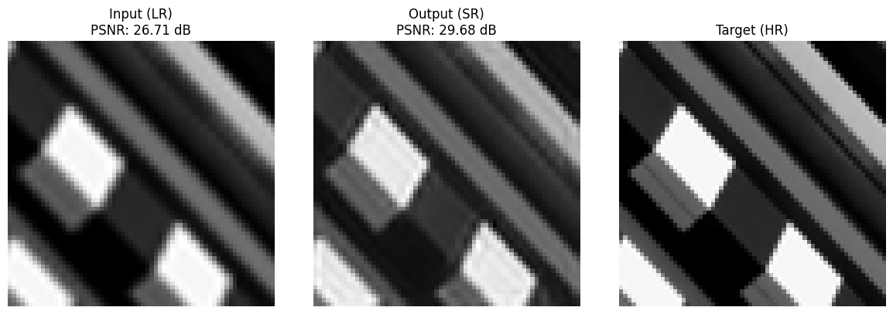

# Super-Resolution using CNN

This repository implements a lightweight **image super-resolution model** based on **SRCNN (Super-Resolution Convolutional Neural Network)** using PyTorch. The model takes low-resolution grayscale images as input and predicts higher-resolution versions through end-to-end learning.

---

## 📁 File Overview

| File | Description |
|------|-------------|
| `main.py` | main |
| `arguments.py` | Argument parser  |
| `preprocessing.py` | Image splitting, patch extraction, and train/val/test set creation |
| `dataloader.py` | Loads preprocessed patches into PyTorch Datasets and DataLoaders |
| `model.py` | SRCNN model architecture |
| `train.py` | Train & valid model |
| `test.py` | Test model & displays visual results |
| `utils.py` | Utility functions: PSNR calculation, dynamic importing, directory creation |

---
> 📚 **Dataset Source**  
> The Urban100 dataset used in this project was obtained from Kaggle:  
>  
> [Urban100 Dataset on Kaggle](https://www.kaggle.com/datasets/harshraone/urban100)  
>  
> Credit: Dataset uploaded by [Harsh Raone](https://www.kaggle.com/harshraone)


## 📊 Dataset Structure
> The Urban100 dataset used in this project was obtained from Kaggle:    
> [Urban100 Dataset on Kaggle](https://www.kaggle.com/datasets/harshraone/urban100)  
>
> The structure follows this hierarchy:  
- xL Low-Resolution image, y: High-Resolution image
- patch size: 64x64

---

## 🖼️ Sample Results

Below are visualizations of the model's performance on test images.  
From left to right:  
**Low-resolution input (LR) → Super-resolved output (SR) → Ground-truth high-resolution (HR)**

<p align="center">
  
  <br>
  
  <br>
  
</p>
---

## 🚀 How to Run

```bash
# Run training and evaluation
python main.py
