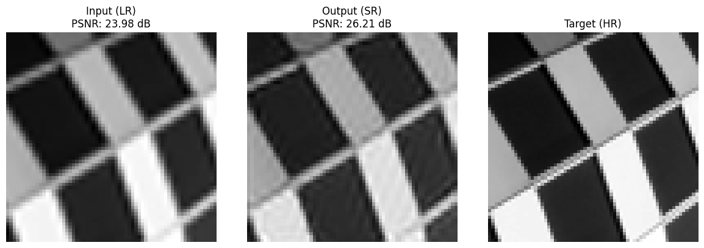

# Super-Resolution using CNN

This repository implements a lightweight **image super-resolution model** based on **SRCNN (Super-Resolution Convolutional Neural Network)** using PyTorch. The model takes low-resolution grayscale images as input and predicts higher-resolution versions through end-to-end learning.

---

## 📁 File Overview

| File | Description |
|------|-------------|
| `main.py` | Main execution script for training, testing, and visualizing results. |
| `arguments.py` | Argument parser containing configurable options (batch size, patch size, paths, etc). |
| `preprocessing.py` | Image splitting, patch extraction, and train/val/test set creation. |
| `dataloader.py` | Loads preprocessed patches into PyTorch Datasets and DataLoaders. |
| `model.py` | Defines the SRCNN model architecture. |
| `train.py` | Handles training loop and validation evaluation. |
| `test.py` | Evaluates model on test data and displays visual results. |
| `utils.py` | Utility functions: PSNR calculation, dynamic importing, directory creation. |

---

## 📊 Dataset Structure

All data is stored in the `./data/Urban100` directory. The structure follows this hierarchy:

- `image_SRF_2/` 폴더는 raw image 쌍을 포함합니다.  
- `x/`는 Low-Resolution 이미지, `y/`는 High-Resolution 이미지입니다.
- 이미지들은 `64x64` 패치로 나누어 학습합니다.

---

## 🖼️ Sample Results

Below are visualizations of the model's performance on test images.  
From left to right:  
**Low-resolution input (LR) → Super-resolved output (SR) → Ground-truth high-resolution (HR)**

<p align="center">
  
  <br>
  
  <br>
  
</p>

> 📁 Make sure to place 3 sample output images (e.g. `sample1.png`, `sample2.png`, `sample3.png`) in the `results/` directory.

---

## 🚀 How to Run

```bash
# (1) Install dependencies
pip install -r requirements.txt

# (2) Run training and evaluation
python main.py

---

## 🔧 다음 작업 추천

- `results/` 폴더 만들고 `sample1.png`, `sample2.png`, `sample3.png` 넣기
- `README.md` 루트 디렉토리에 저장
- 필요 시 `requirements.txt`도 생성 (`torch`, `tqdm`, `numpy`, `matplotlib`, `scikit-learn`, `Pillow`)
